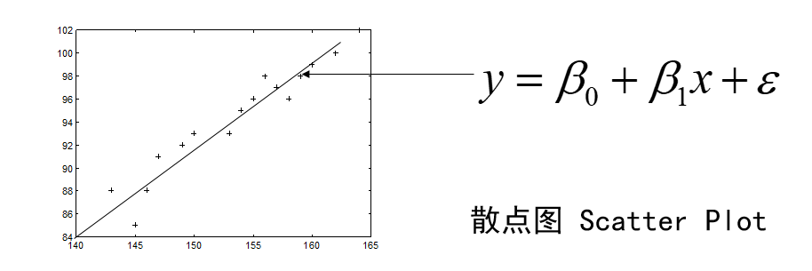

# 数据科学入门1.2：回归的基本概念
## Introduction to Data Science Part1.2: Basic definitions

## 什么是回归
**回归是一种统计学方法，用于找到两个或多个变量之间的关系** 。回归中有两种变量一种是independent variable，另一个dependent variable。正如他们名字说的那样，dependent variable是依赖independent variable的。回归一般是用于预测的，就是给出independent variable的值，回归模型可以给出一个dependent variable的预测值，注意这个预测值是一个连续变量不断是ratio或者interval，他一定是连续的。

有些基础的回归模型除了直接给出预测值，他还能给出这两个变量的关系，你能看出，当某个变量增加的时候增加的时候，dependent variable是增加还是减少，影响有多大。但是这个并不表示因果关系（causality）。例如通过分析发现7-10岁的小孩中，脚越大，智商越高。你说这个脚和脑子有啥关系？后来通过更加理性的分析发现，7-10岁的小孩中，脚越大，年龄也越大，所以智商就高。这也是运用机器学习方法需要注意的一些问题。最后，回归一般给出的结果是连续的，如果一个模型给出的结果是有限离散的，可能就是分类和聚类问题了。

虽然回归是一个机器学习方法，但是一些机器学习的基本概念，我们在后面慢慢的引入。

## 简单线性回归

### 基本概念

我们先看个简单的例子：

>测16名成年女子的身高与腿长所得数据如下：

|    身高    |    143    |    145    |    146    |    147    |    149    |    150    |    153    |    154    |    155    |    156    |    157    |    158    |    159    |    160    |    162    |    164    |
|------------|-----------|-----------|-----------|-----------|-----------|-----------|-----------|-----------|-----------|-----------|-----------|-----------|-----------|-----------|-----------|-----------|
|    腿长    |    88     |    85     |    88     |    91     |    92     |    93     |    93     |    95     |    96     |    98     |    97     |    96     |    98     |    99     |    100    |    102    |

以身高x为横坐标，以腿长y为纵坐标将这些数据点（xi，yi）在平面直角坐标系上标出. 

我们可以看到这里的一个散点图（Scatter Plot），你们在做数据科学的时候最常用的一个图应该就是散点图了，它可以在一个图把所有的观测数据显示出来，他的每个轴就是观测数据的一个变量，我们一般把independent variable称为 $x$ ,而dependent variable称为 $y$ 。可以看到有个明显的关系，就是身高越高的姐姐腿也越长。所以很显然的，我们可以拟合（fit）1条直线，这个是我们中学就学过的。

我们看一下这个图中的直线：
$$
\hat{y}=\beta_0+\beta_1x \tag{1}
$$
这就是一个回归模型。我们介绍一下其中的几个概念，首先是independent variable：$x$ ，然后是dependent variable：$y$ 。我们就是用已知的 $x$ 去预测未知的 $y$ 。然后还有一个就是我们模型的参数 $\beta$ ，只有确定了参数才是一个真正的模型。然后还有个一很重要的就是 $\hat{y}$ ，我们读作“y hat”这个一般表示预测值。

然后我们看一下发现这个散点图的点，有很多没有落在这条直线上，这是因为下面这个公式：
$$
y=\beta_0+\beta_1x+\epsilon \tag{2}
$$
这个公式里面的 $\epsilon$ 表示一个误差。这个公式表示 $y$ 也就是我们的观测值，也叫做“ground truth”，是在这个模型上增加了一个误差的，我们的模型是我们认为的一个关系，观测值符合这个模型，但是由于观测或者获取数据有误差导致了观测值不在这个模型上。这也就是说一个回归模型反应的是：
$$
\hat{y}= E(Y|X)=f(X,\beta)
\tag{3}
$$
上面的公式是说，预测值 $\hat y$ 表示的是一个期望值，表示在给出 $x$ 的情况下 $y$ 的期望值。回归模型只不过是一个函数，是independent variable $x$ 和参数 $\beta$ 的函数，不过对于一个确定的模型 $\beta$ 是确定的。

我们首先讲的是线性回归，那什么是线性回归呢？

**线性回归是一个回归模型，他是参数 $\beta$ 的线性函数**，注意不是要求independent variable $x$ 的线性函数，下面都是线性回归模型：
$$
\hat{y}=\beta_0+\beta_1x \tag{4}
\\
\hat{y}=\beta_0+\beta_1x+\beta_2x^2+\beta_3x^3
\\
\hat{y}=\beta_0+\beta_1x_1+\beta_2x_2+\beta_3x_3
$$
不管你的 $x$ 在模型函数中是不是线性，假设你有 $\sin(x)$ ，那把整个$\sin(x)$ 看成一个新的independent variable就行。

**那我们是怎么确定这些参数 $\beta$ 的呢？**

这里就要说回归模型建立的方法了，一般我们都是使用的 **Ordinary least squares（OLS）** 这个方法。这个方法其实大家都知道就是我们中学时候学过的最小二乘法。

我们要做的就是最小化我们模型预测的结果与我们观测数据的误差。误差怎么表示呢？就如上图和下面这个公式。
$$
E=\sum_{i=1}^n(y_i-\hat{y_i})^2 \tag{5}
$$
我们只要最小化观测的 $y$ 和预测的 $\hat{y}$ 的差的平方和就行，这个东西叫做MSE Mean Squared Error。

要注意的是这种方法有几个假设，我们后面慢慢说，这里就说一个，这个误差是由于我们对 $y$ 的观测，和 $y$ 本身的噪声造成的，和 $x$ 是没有关系的。你看我们预测的时候 $\hat{y_i}=f(x_i)$ ，这个 $x_i$ 和我们观测样本 $(y_i,x_i)$ 是同一个。也就是说 $x$ 的观测是没有误差准确的。

