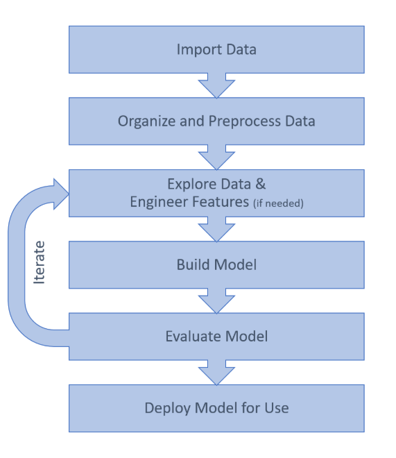

# 数据科学入门2.1.1：机器学习介绍

<!-- keywords:建模预防站;讲义;回归;MATLAB;机器学习; -->
<!-- description:介绍了机器学习的一些概念，并且讲讲了用matlab中的machine learning and statistics toolbox做回归的一些玩法。 -->
<!-- coverimage: -->
<!-- 
-->

## 机器学习的一些基本概念

OK，终于我们开始讲机器学习了，不过实际上我们已经讲过了，如果大家还记得我们之前讲的线性回归的那些课程，那些就是机器学习。我们现在只不过是要学习一些更加复杂，以及更多类型的机器学习方法。

首先我们会开始介绍一些概念，事实上，整个课程中我们都会不断的引入一些概念，请大家注意哪些加粗了的字。

机器学习有一个基本的套路就是如下图：

大家感受一下，可以看到我们都是以数据为中心的，我们在后面会把这些过程都体验一遍。

### 机器学习的种类

首先，我们可以把机器学习分为**监督学习**和**非监督学习**两类。但是要注意，机器学习问题并不只会有这两类，只是这两个是最常见的两种分法。

**监督学习（Supervised Learning）：** 就是我们的**模型**采用的训练数据是有**标签（label）**。就是所有的数据每一个样本除了**特征（feature）**以外，还有一个与之对应的标签。这个标签是这个样本的真实值（ground truth），也是我们模型要预测的目标。举个例子：

  
*通过图片试别是猫还是狗*

比如用上面这一组照片数据训练一个模型，它可以判断照片里的是猫还是狗。可以看到这个训练数据中每一个照片下面都有一个字指出他是cat还是dog。下面的cat和dog，表明这个照片里面动物是啥，就是**标签**，我们根据照片要预测这个。而这个照片本身就是**特征**。用这一组数据训练出一个模型，就叫做**监督学习**。

监督学习的本质就是找到一个函数 $\hat y=f(x)$ ， $x$ 就是特征，$ \hat{y}$ 就是预测的目标，我们通过训练就是要找到一个f(x)可以把特征x映射整标签y。

监督学习一般也可以分成两类，一个是**回归（regression）**，还有一个是**分类（classification）**。

**回归**： 就是之前讲过，他输出的预测值 $\hat{y}$ 是一个连续的数字，就是说 $\hat{y}$ 的取值值无穷多中的，比如预测明天的电量消耗，可以是100度也可以是100.25度。

**分类**：就是这个模型的输出值是一个有限的离散的量。例如个刚刚看到的猫狗，他只能给出这玩意是猫还是狗。有的分类给的是属于某个分类的概率，**但是，只要训练数据的标签是优先离散的，就是分类**。

这里再提一下，什么是**标签**，就是每个样本的真实值，**训练集**的里样本的标签所是已知的，用它来**训练(train，fit)**我们的模型。而**测试集**的样本对于模型来说标签是未知的，但是我们是知道的，所以可以评估这个模型的好坏。对于外来实际应用的时候，标签是没有的，就是我们要预测的。

还要说一下什么是**特征**，特征就是模型的输入，例如刚刚说的那个照片。特征里包含了有用的信息，这些信息可以帮我们**推测（inference）**出标签。对于电脑来说，他只认识数字，所以我们认为的特征，比如现状颜色图片声音这些，都要转换为数字，准确的说是向量或者矩阵。

**非监督学习（unsupervised learning）：** 就是模型采用的训练数据是没有标签的，只有特征。那魔心怎么知道怎么学习呢？我们举几个例子

首先最典型的非监督学习就是**聚类（Clustering）**，例如下面这个例子：

同样是判断一个东西是猫还是狗，但这一次我只给她图片，不给他标签，不告诉这个模型那个是猫还是狗。模型通过聚类分析，会把接近的分成一类。猫和毛长得都比较接近，狗也是这样。所以他能区分出这是两类物，但是不知道他们是什么动物。如果给他一个新的动物，他能把他归到其中某一类，但是他不知道猫狗这个概念。

其实除了监督学习，非监督学习还有别的机器学习种类，例如强化学习、异常检测、等等，这个课程暂时就不讲这些了。大家有时候听到深度学习概念，其实他只是机器学习的一种建立模型的算法，它可以用来实现上面各种类型的机器学习应用。
